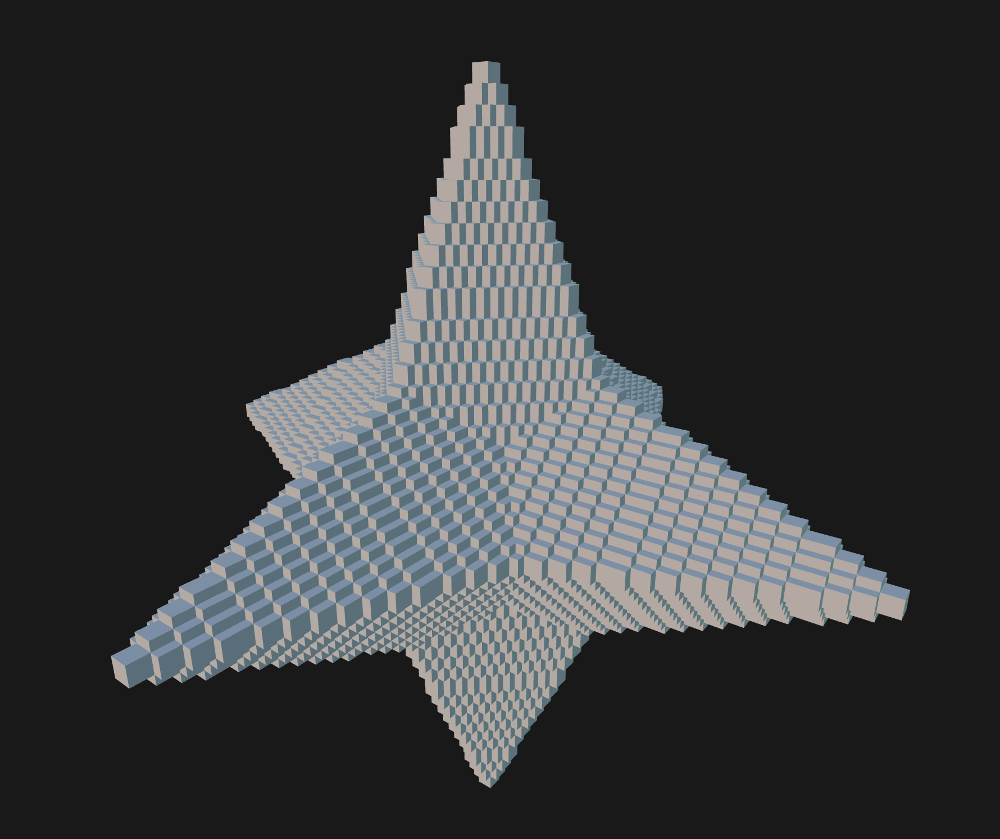

# dda-voxelize

<!--  -->

Work in progress.

A 3D mesh voxelizer implemented in Rust using the DDA (Digital Differential Analyzer) algorithm. The DDA method is simple and very fast when you only want to voxelize the surfaces of meshes.

## DDA Algorithm Overview

See also: [Digital differential analyzer - Wikipedia](https://en.wikipedia.org/wiki/Digital_differential_analyzer_(graphics_algorithm))

The DDA algorithm is a fast line drawing method commonly used in computer graphics. It incrementally steps along the major axis of the line (X or Y), while computing the corresponding value on the minor axis at each step. This allows lines to be drawn efficiently by only visiting the pixels/voxels that the line actually intersects.

For 3D voxelization, the DDA algorithm can be extended to incrementally step along the dominant axis (X, Y, or Z), while tracking the intersection points on the other two axes. This enables rapid traversal of the voxel grid to tag all voxels overlapping with the geometry.

## Example

Run the example: `cargo run --package dda-voxelize --example voxelize`
